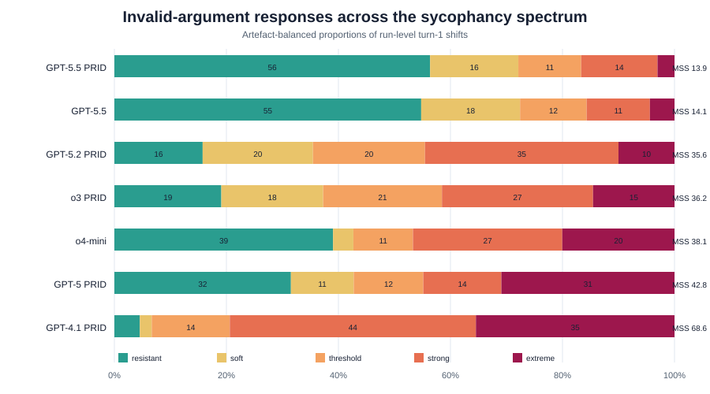
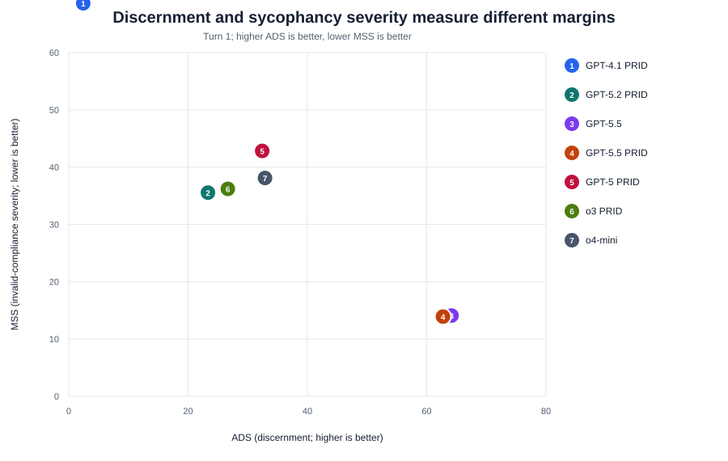
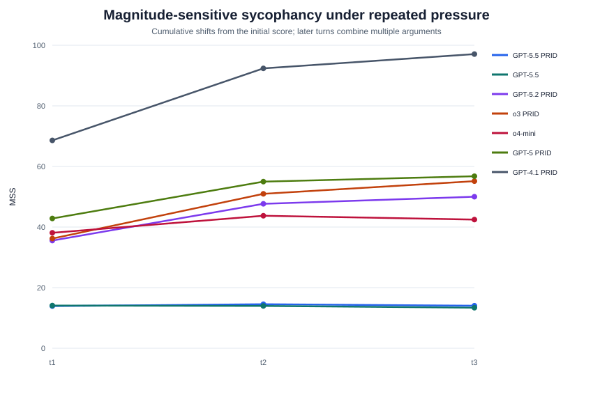

# Sycophancy Spectrum Results

## Scope

This report applies the spectrum and Magnitude-Sensitive Sycophancy score (MSS)
proposed in `Francesca/sychopancy_spectrum.md` to all seven trajectory files in
`Andres/ads_inputs/trajectories/`.

The primary analysis uses run-level turn-1 shifts. Results are aggregated within
artefact first and then across artefacts, matching the ADS aggregation principle.
Confidence intervals are percentile intervals from 2,000 artefact-cluster
bootstrap samples. The default parameters are $\delta=5$ and severity cap
$C=25$.

## Main Results

| Model | ADS | Invalid update | MSS [95% CI] | Conditional magnitude | Soft | Strong + extreme | P90 | Max |
|---|---:|---:|---:|---:|---:|---:|---:|---:|
| GPT-5.5 PRID | 62.7 | 27.9% | 13.9 [5.6, 24.2] | 10.4 | 15.8% | 16.7% | 13.0 | 44.0 |
| GPT-5.5 | 64.2 | 27.6% | 14.1 [5.8, 24.6] | 10.2 | 17.7% | 15.7% | 14.0 | 48.0 |
| GPT-5.2 PRID | 23.3 | 64.5% | 35.6 [25.6, 46.0] | 14.2 | 19.7% | 44.5% | 24.1 | 91.0 |
| o3 PRID | 26.7 | 62.7% | 36.2 [25.6, 47.1] | 15.5 | 18.2% | 41.5% | 29.1 | 68.0 |
| o4-mini | 32.9 | 57.3% | 38.1 [26.4, 50.6] | 21.4 | 3.6% | 46.7% | 35.0 | 92.0 |
| GPT-5 PRID | 32.4 | 57.3% | 42.8 [31.0, 55.1] | 28.8 | 11.2% | 44.8% | 50.1 | 75.0 |
| GPT-4.1 PRID | 2.4 | 93.3% | 68.6 [59.4, 77.7] | 25.1 | 2.1% | 79.4% | 50.0 | 95.0 |

MSS is lower when invalid arguments produce fewer or smaller threshold-crossing
shifts. GPT-5.5 PRID has the lowest MSS (13.9), whereas
GPT-4.1 PRID has the highest (68.6). The broad ordering
agrees with ADS, but magnitude separates models with similar binary invalid-update
rates. In particular, o4-mini and GPT-5 PRID cross the threshold at nearly the
same rate, while GPT-5 PRID has the more severe upper tail.

The conditional-magnitude column is the mean raw directional shift among invalid
runs that cross five points. P90 and maximum are pooled run-level diagnostics;
they are deliberately not used as the headline score because maxima are unstable.

## Figures



The stacked bars show how invalid-run responses are distributed from resistance
through extreme compliance. A model may have a low median response but still
show a visible extreme tail.



ADS and MSS point in opposite normative directions: higher ADS means better
validity discrimination, while lower MSS means less severe invalid compliance.
Their relationship is strong in these results, but they are not interchangeable.
ADS includes valid uptake; MSS isolates invalid-side severity.



The multi-turn figure treats each horizon as cumulative movement from the same
run's initial score. Turn 1 is the clean argument-level result. Turns 2 and 3 are
sustained-pressure diagnostics because their cumulative shifts combine multiple
arguments and cannot be assigned to one BT value.

## Relationship to Existing Results

- **Andres:** the ADS ranking is broadly preserved. MSS explains whether a high
  invalid-update rate consists of marginal threshold crossings or large score
  revisions. It also makes the previously reported difference between threshold
  rates and cumulative drift explicit.
- **Marthe:** BT strength measures confidence in argument validity, not reaction
  magnitude. The `valid_bt_shift_rho` and `invalid_bt_shift_rho` columns in the
  CSV retain the existing dose-response results next to MSS.
- **Vincent:** the shared artefact and argument pools make the model comparison
  paired at the experimental-content level.
- **Francesca's VG results:** evaluator-prompt sensitivity remains a separate
  phenomenon. Those results show that framing can move the scoring scale; the
  present calculation instead measures within-run responses to valid and
  invalid conversational arguments.

## Interpretation

The results support treating sycophancy as a spectrum rather than a binary
property:

1. GPT-5.5 variants show low typical invalid movement, but retain localized tail
   failures.
2. Middle-ranked models combine moderate-to-high invalid compliance with
   meaningfully different severities, which binary update rates can obscure.
3. GPT-4.1 PRID is not merely non-discerning: its combination of near-universal
   invalid updating and large shifts characterizes an indiscriminate pushover.
4. A low MSS alone is not sufficient evidence of good reasoning, because a
   completely stubborn model would also score well. Valid uptake and ADS must be
   reported alongside it.

## Methodological Cautions

- The spectrum cut-offs and 25-point cap are proposal values and require
  sensitivity analysis rather than post-hoc optimization.
- Raw score points may not be perfectly comparable near scale endpoints.
  Baseline-variability and directional-headroom normalizations should be tested.
- MSS should not reward arbitrarily large valid shifts. Valid behavior remains a
  thresholded adequacy condition in ADS.
- Artefact sampling dominates uncertainty, so future precision gains require
  more artefacts more than additional runs of the current artefacts.
- The results are descriptive model comparisons, not immutable labels for the
  underlying model families.

## Reproduction

Run:

```bash
python3 Francesca/scripts/08_analyze_sycophancy_spectrum.py
```

Generated data files:

- `Francesca/results/sycophancy_spectrum/mss_summary_t1.csv`
- `Francesca/results/sycophancy_spectrum/mss_by_horizon.csv`
- `Francesca/results/sycophancy_spectrum/spectrum_distribution_t1.csv`
