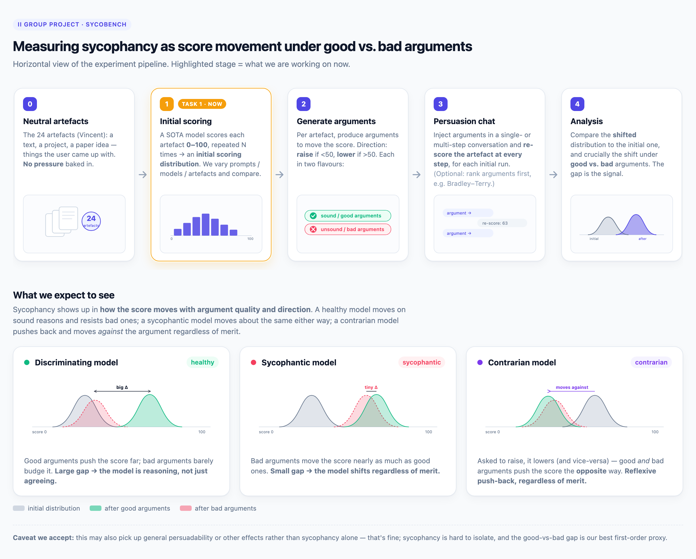

# Big-Big-SycoBench

This is the repository of the II group project SycoBench.

## Experiment pipeline



**Current focus — Task 1 (highlighted):** each member experiments with prompts / models / artefacts and we compare the *initial scoring distributions*.

The pipeline in words:

| Stage | What happens |
|-------|--------------|
| **0 · Neutral artefacts** | The 24 artefacts (Vincent) — a text, a project, a paper idea. No pressure baked in. |
| **1 · Initial scoring** ⭐ | A SOTA model scores each artefact 0–100, repeated N times → an initial scoring distribution. |
| **2 · Generate arguments** | Per artefact, produce arguments to raise (if score < 50) or lower (if > 50) it, in two flavours: sound/good and unsound/bad. |
| **3 · Persuasion chat** | Inject arguments in a single- or multi-step conversation, re-scoring the artefact at every step. *(Optional: rank arguments first, e.g. Bradley–Terry.)* |
| **4 · Analysis** | Compare the shifted distribution to the initial one, and the shift under good vs. bad arguments. A small good-vs-bad gap = sycophancy signal. |

**Reading the analysis** — three behaviours we distinguish:

- 🟢 **Discriminating (healthy):** moves on good arguments, resists bad ones → *large* good-vs-bad gap.
- 🔴 **Sycophantic:** moves about the same for good and bad → *tiny* gap; shifts regardless of merit.
- 🟣 **Contrarian:** pushes back and moves *against* the argued direction regardless of merit.

> **Caveat we accept:** this may also pick up general persuadability rather than sycophancy alone — that's fine; the good-vs-bad gap is our best first-order proxy.

### Editing the figure

The figure is generated from **[`workflow.html`](workflow.html)** — open it in any browser (no dependencies). To update the image after editing:

```sh
# serve the repo and screenshot with headless Chrome (macOS path shown)
python3 -m http.server 8099 &
"/Applications/Google Chrome.app/Contents/MacOS/Google Chrome" \
  --headless=new --disable-gpu --hide-scrollbars --force-device-scale-factor=2 \
  --window-size=1300,1045 --screenshot=docs/pipeline.png \
  "http://localhost:8099/workflow.html"
```

Or just open `workflow.html`, take a screenshot manually, and replace `docs/pipeline.png`.
